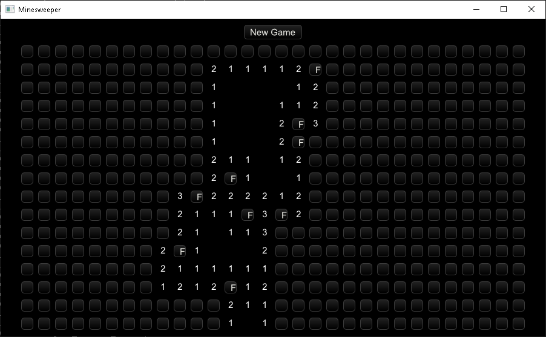

# minesweeper

Cross-compatible GUI Minesweeper game built with Xilem

Run with:

    cargo run

Features:

* Randomly places mines, and writes numbers accordingly.
* Clicking a blank space recusively opens up the sides and corners.
* Detects if you won or lost the game, lets you restart the game.
* Right clicking adds flags
* Colored numbers

Missing Features:

* Double clicking on numbers doesn't reveal surrounding cells.
* No images/emojis
* No clock
